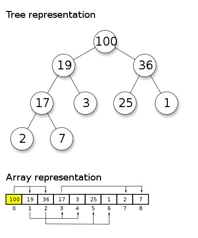

The purpose of this class is to introduce the idea of a _priority queue_ and an implementation in the form of a _heap_. 

# Lecture/Live-Code

## Priority Queue

A _priority queue_ is like a queue, but instead of being ordered by entry, they are ordered by some ranking. Elements with higher ranking exit the queue first. Elements are inserted into the queue not at the back, but in sorted order by ranking. 
### Pause & Think

Come up with a few scenarios in which you might want to represent your data using a priority queue. 

### What Kinds of Operations?

Because a priority queue is essentially being constantly sorted, we need very fast add operations, as well as a simple way to remove in order. That is, add should run quickly with arbitrary position, but remove need only run quickly for the _first_ position. In other words, we need something where it's easy to add any element and trivial to find the smallest (or largest) element. 

A balanced binary tree is not a bad choice for this purpose, but finding the smallest or largest element can be tricky. We therefore turn to another tree-like structure called a _heap_. 

## Heaps

A heap is a tree-like structure that can be represented as an array. This means we get all the benefit of fast addition to a tree, with all the benefit of fast removal and direct ordering of an array. The only thing we lose is fast lookup, which we don't mind very much, because if we're using a priority queue we probably just want the first thing. 

For every node in the tree, you can map it to an array. You find node _i_'s left child at _2i + 1_, the right child at _2i + 2_, and the parent at _(i-1)/2_. Notice in this case we are using integer division; that is, node 4's parent can be found at position (4-1)/2 = 3/2 = 1.

Notably, **the implementation of a heap need not use any pointers at all**. It can be done with a simple array and arithmetic. 

### Addition

Addition starts at the back, and then "bubbles up" until it hits the correct place in the queue. A new node has to come up the tree until it's in the right place, and because the structure of the tree relies on simple priority (greater-than and less-than), we can just compare it to its own parent to see if it needs to keep moving upward. 

Addition does _not_ guarantee that the priority queue is perfectly sorted; it only guarantees that the _first_ element is the smallest element. 

### Removal

Removal should only happen from the root if we're thinking about a heap-based priority queue; why? 

In this case, removal 'trickles down'; the last node becomes the new root, and then we let it fall back into its proper place by checking children rather than parents and siblings. 